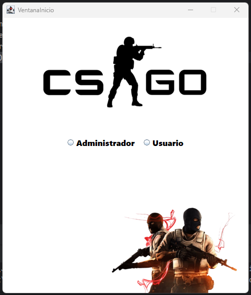
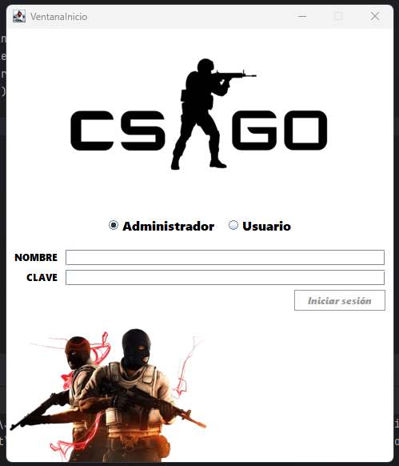
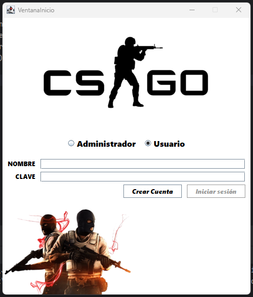

# ◾ Índice

- [Descripción](#descripcion)
- [Colaboradores](#integrantes)
- [Tecnologías Utilizadas](#tecnologias)
- [Instalación](#instalacion)
- [Uso](#uso)
- [Aspecto](#aspecto)
- [tests](#tests)
- [Estado del Proyecto](#estado)

---

<h1 id="descripcion">◾ Gestión de Competición CSGO</h1>

Aplicación pensada para gestionar competiciones de CSGO. Permite registrar equipos y jugadores, generar automáticamente el calendario de enfrentamientos y guardar los resultados de cada jornada.

---

<h1 id="integrantes">◾ Integrantes del equipo</h1>

<table border="0">
  <tr>
    <td>
      <ul>
        <li><em>Danel Rivas</em></li>
        <li><em>Ibai López</em></li>
        <li><em>Ibai Mendoza</em></li>
        <li><em>Daria Kuznetsova</em></li>
        <li><em>Farrukh Mohammad</em></li>
      </ul>
    </td>
    <td>
      
    </td>
  </tr>
</table>


---

<h1 id="tecnologias">◾ Tecnologías Utilizadas</h1>

-  **Tecnologías de Desarrollo**

    
    
    
    
    

-  **Herramientas de Organización y Comunicación**

    
    
    

---

<h1 id="instalacion">◾ Instalación</h1>

1. Clona el repositorio:
   ```bash
   git clone https://github.com/EquipoDFIID/Fase3.git
   ```

2. Abre el proyecto en IntelliJ IDEA o cualquier IDE compatible.

3. Configura la conexión a la base de datos Oracle.

4. Ejecuta la clase principal para iniciar la aplicación.

---

<h1 id="uso">◾ Uso</h1>

Tiene dos tipos de usuarios:

- **Administradores**: gestionan equipos, jugadores, calendario y resultados.
- **Usuarios normales**: pueden consultar informes.

**Inicio de sesión** según su tipo:
- Usuario administrador:
  - Nombre: admin1
  - Clave: admin1
- Usuario normal:
  - Nombre: usr1
  - Clave: usr1

---

<h1 id="aspecto">◾ Aspecto</h1>

Esta es la pantalla principal de la aplicación, donde se muestra el logo de CSGO y eliges tu tipo de usuario.

  

Estas dos ventanas muestran los campos para introducir las credenciales y en usuario además veremos un botón que nos facilitará la creación de un usuario si no existe.

    


---

<h1 id="tests">◾ Tests</h1>

- Se usó **JUnit 5** para pruebas unitarias.
- Clases testeadas:
> Añadir clases en las que se han hecho los test.

---

<h1 id="estado">◾ Estado del Proyecto</h1>

🚀 Proyecto en proceso

---


